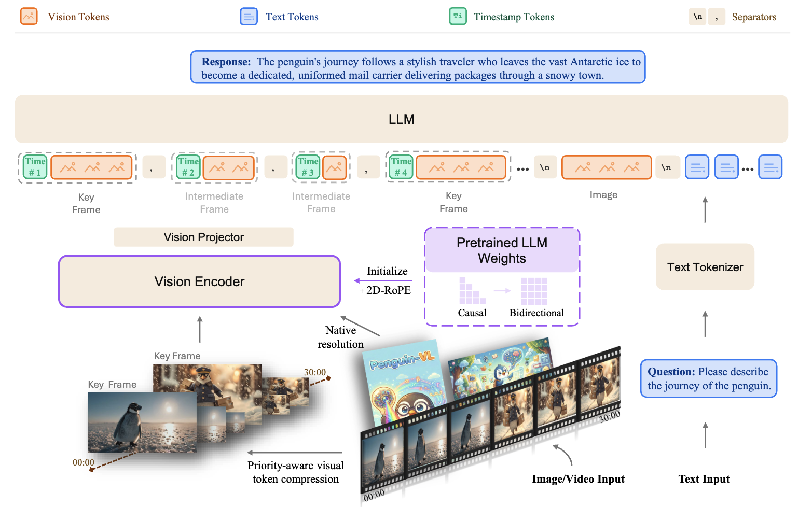
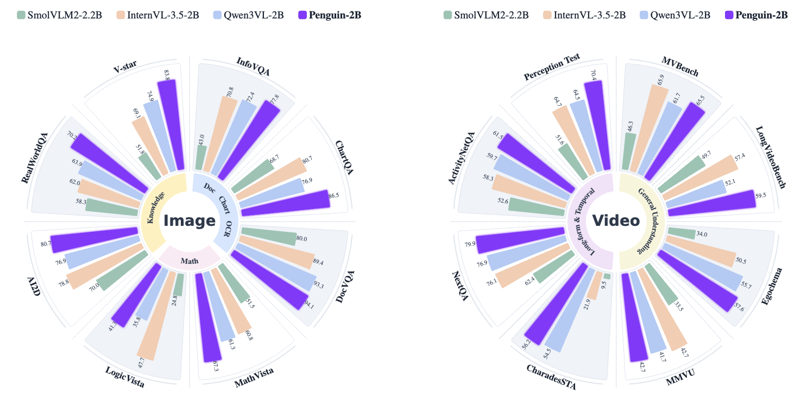

<p align="center">
    
</p>

<h3 align="center">Penguin-VL: Exploring the Efficiency Limits of VLM with LLM-based Vision Encoders</h3>

<h5 align="center">

[](https://huggingface.co/tencent/Penguin-VL-2B)
[](https://huggingface.co/tencent/Penguin-VL-8B)
[](https://huggingface.co/tencent/Penguin-Encoder) <br>
[-F6C343.svg)](https://huggingface.co/xxx)
[](https://huggingface.co/papers/xxx.xxxx)
[](https://arxiv.org/abs/xxx.xxxx)
</h5>

---

## 📰 News

* **[2025.03]** Release inference code, vLLM plugin, and Gradio demo for Penguin-VL.
* **[2025.03]** Release [Penguin-VL-2B](https://huggingface.co/tencent/Penguin-VL-2B), [Penguin-VL-8B](https://huggingface.co/tencent/Penguin-VL-8B), and [Penguin Vision Encoder](https://huggingface.co/tencent/Penguin-Encoder) on Hugging Face.

---

## ✨ Overview

**Penguin-VL** is a compact vision-language model family built to study how far multimodal efficiency can be pushed by redesigning the **vision encoder**, rather than only scaling data or model size.

Most modern VLMs rely on vision encoders pretrained with large-scale **contrastive objectives** such as CLIP or SigLIP. Penguin-VL argues that this setup can be suboptimal for multimodal reasoning because contrastive learning favors coarse category-level invariances over the fine-grained signals needed for **OCR, document understanding, dense captioning, and complex reasoning**. Instead, Penguin-VL introduces **Penguin-Encoder**, a vision encoder **initialized from a text-only LLM**, so the visual backbone starts closer to the language model representation space and learns more data-efficiently.

<p align="center">
  
</p>
<p align="center">
  <em>Framework overview of Penguin-VL: an LLM-initialized vision encoder, mixed-supervision pretraining, and efficient video token compression.</em>
</p>

### Highlights

- **LLM → Vision Encoder initialization (Penguin-Encoder)**  
  Initialize the vision encoder from a text-only LLM (e.g., Qwen3-0.6B), convert causal attention to **bidirectional attention**, and add **2D-RoPE** for variable-resolution vision tokens.

- **Mixed-supervision encoder pretraining**  
  Warm up the LLM-initialized encoder with a reconstruction/distillation objective (amplitude / direction / relation losses) to inject visual knowledge stably, then switch to high-resolution alignment.

- **Video efficiency via Temporal Redundancy-Aware (TRA) token compression**  
  Dynamically allocate token budgets across **key frames vs. intermediate frames** under a global token budget to scale to long videos more efficiently.

- **Unified training recipe**  
  A low-to-high resolution curriculum + instruction tuning strategy that balances image and video capabilities at compact scale.

---

## 📈 Results

Penguin-VL-2B delivers a strong accuracy-efficiency tradeoff across image and video benchmarks, with especially solid gains on OCR-heavy and reasoning-heavy tasks where fine-grained visual understanding matters most.

<p align="center">
  
</p>
<p align="center">
  <em>Benchmark snapshot for Penguin-VL-2B across image and video evaluation suites.</em>
</p>

The released checkpoints and encoder weights are listed below.

---

## 📦 Model Zoo

| Model | Hugging Face |
| :---- | :----------- |
| **Penguin-VL-2B** | [tencent/Penguin-VL-2B](https://huggingface.co/tencent/Penguin-VL-2B) |
| **Penguin-VL-8B** | [tencent/Penguin-VL-8B](https://huggingface.co/tencent/Penguin-VL-8B) |
| **Penguin Vision Encoder** | [tencent/Penguin-Encoder](https://huggingface.co/tencent/Penguin-Encoder) |

---

## 🛠️ Environment Setup

### Requirements

- **Python** = 3.11.13 (recommended)  
- **PyTorch** ≥ 2.5 (CUDA 12.4 recommended)  
- **CUDA** ≥ 11.8  

### Installation

```bash
# Clone the repository
git clone <repo_url>
cd <repo_name>

# Recommended: create and activate a clean conda environment
conda create -n PenguinVL python=3.11.13 -y
conda activate PenguinVL

# INSTALL ffmpeg if you don't have it on your system
conda install ffmpeg -y # optional

# Install dependencies (inference + Gradio demo)
pip install -r requirements.txt

# NOTE: If you plan to use vLLM, it's recommended to install vLLM before flash-attn (see § vLLM Inference).
# Install Flash Attention (recommended for faster inference)
pip install flash-attn==2.8.3 --no-build-isolation
```

### Version Notes

| Use Case | Recommended |
| :------- | :---------- |
| **Transformers inference** | `transformers==4.51.3` |
| **vLLM inference** | Install vLLM separately (see [§ vLLM Inference](#-vllm-inference)) |

---

## 🤖 Inference (Transformers)

Use HuggingFace `AutoModelForCausalLM` + `AutoProcessor` for image, video, and text.

```bash
python inference/example_penguinvl.py
```

You can provide a customized `--model-path` argument to the script (default: `tencent/Penguin-VL-8B`). Supported formats:

- **Video:** `type: "video"` with `video_path`, `fps`, `max_frames`
- **Image:** `type: "image"` with `image_path`
- **Mixed:** image + video + text in one conversation
- **Text-only:** plain text dialogue

---

## 📓 Cookbook

Checkout the inference notebook for a GitHub-friendly walkthrough of Penguin-VL across diverse tasks.  
Unlike a multi-notebook cookbook, Penguin-VL currently provides **one consolidated notebook** that covers multiple representative examples in a single place.

| Notebook | Description |
| :------- | :---------- |
| [Inference Recipes](inference/notebooks/01_penguinvl_inference_recipes.public.ipynb) | Demonstrations of Penguin-VL for **visual code generation**, **OCR/document parsing**, **creative image understanding**, **table extraction**, **multi-round chart analysis**, **multi-round video understanding**, **mixed video+image prompting**, and a **text-only baseline**. |

If you want to re-execute the notebook locally and regenerate the GitHub-previewable output:

```bash
export PENGUIN_VL_MODEL_PATH=tencent/Penguin-VL-8B

jupyter nbconvert \
  --to notebook \
  --execute \
  --output 01_penguinvl_inference_recipes.public.ipynb \
  --ExecutePreprocessor.timeout=-1 \
  --ExecutePreprocessor.kernel_name=penguinvl \
  inference/notebooks/01_penguinvl_inference_recipes.source.ipynb
```

The clean source notebook lives at [inference/notebooks/01_penguinvl_inference_recipes.source.ipynb](inference/notebooks/01_penguinvl_inference_recipes.source.ipynb).

---

## ⚡ vLLM Inference

> Installing **vLLM 0.11.0** requires **PyTorch 2.8** and the corresponding compatible version of **Flash Attention**. This setup may different from the default Transformers inference environment (which recommends PyTorch ≥ 2.5). To avoid version conflicts, you may need to create a separate environment or upgrade dependencies accordingly.  
> **Install order note:** if you plan to use vLLM, it's recommended to install **vLLM first**, and then install **Flash Attention**.

### Environment

- The vLLM plugin targets **vLLM 0.11.0** (`penguinvl/plugin/vllm/v0_11_0/`).
- vLLM is not in `requirements.txt` by default; install it separately:

```bash
pip install vllm==0.11.0
```

### Troubleshooting

- **Flash Attention / `flash-attn` import errors** (e.g., `ImportError: ... undefined symbol: ...`): try reinstalling `flash-attn`:

```bash
pip uninstall flash-attn
pip install flash-attn --no-cache --no-build-isolation
```

- **`cannot find -lcuda` during flashinfer build**:

```bash
export LIBRARY_PATH=/usr/lib/x86_64-linux-gnu:$LIBRARY_PATH
# or /usr/local/cuda/lib64 depending on your CUDA install
```

### Start vLLM Server

```bash
# Single GPU
python -m penguinvl.plugin.vllm serve tencent/Penguin-VL-8B

# Multi-GPU (e.g. 8B on 2 GPUs)
python -m penguinvl.plugin.vllm serve tencent/Penguin-VL-8B --port 8000 --tensor-parallel-size 2
```

Additional options: `--host`, `--max-model-len`, etc. (see vLLM 0.11 `serve` docs).

### vLLM Demo Script

Run text, image, video, and batch demos:

```bash
# All demos (single GPU)
CUDA_VISIBLE_DEVICES=0 python inference/test_vllm_infer.py --model-path tencent/Penguin-VL-8B

# Text-only
CUDA_VISIBLE_DEVICES=0 python inference/test_vllm_infer.py --model-path tencent/Penguin-VL-8B --demo text

# Image (requires --image-path)
CUDA_VISIBLE_DEVICES=0 python inference/test_vllm_infer.py --model-path tencent/Penguin-VL-8B --demo image --image-path assets/inputs/horse_poet.png

# Video
CUDA_VISIBLE_DEVICES=0 python inference/test_vllm_infer.py --model-path tencent/Penguin-VL-8B --demo video --video-path assets/inputs/polar_bear.mp4

# 8B with tensor parallelism (2 GPUs)
CUDA_VISIBLE_DEVICES=0,1 python inference/test_vllm_infer.py --model-path tencent/Penguin-VL-8B --tensor-parallel-size 2
```

| Argument | Description |
| :------- | :---------- |
| `--model-path` | HuggingFace model name or local path |
| `--demo` | `text` \| `image` \| `batch` \| `video` \| `all` |
| `--tensor-parallel-size` | Number of GPUs for tensor parallelism |
| `--max-new-tokens` | Max tokens to generate |
| `--max-model-len` | Max context length |
| `--gpu-memory-utilization` | GPU memory fraction (0–1) |

---

## 🤗 Gradio Demo (Local UI)

Launch a local web UI with image/video upload and chat.

### Quick Start

```bash
python inference/launch_gradio_demo.py --model-path tencent/Penguin-VL-8B
```

Then open **http://localhost:33666** (or your machine’s IP + port) in a browser.

### Options

| Option | Description | Default |
| :----- | :----------- | :------ |
| `--model-path` | Model path or HuggingFace ID | *required* |
| `--server-port` | Backend inference server port | 16667 |
| `--interface-port` | Gradio web UI port | 33666 |
| `--nproc` | Number of backend worker processes | 1 |

### Examples

```bash
# 2B model, default ports
python inference/launch_gradio_demo.py --model-path tencent/Penguin-VL-2B

# 8B model, custom UI port
python inference/launch_gradio_demo.py --model-path tencent/Penguin-VL-8B --interface-port 8080

# Multi-worker backend
python inference/launch_gradio_demo.py --model-path tencent/Penguin-VL-8B --nproc 4
```

---

## 📁 Project Structure

```text
.
├── penguinvl/                    # Core model and processor code
│   ├── plugin/vllm/              # vLLM plugin (v0_11_0)
│   └── ...
├── inference/
│   ├── example_penguinvl.py      # Transformers inference example
│   ├── test_vllm_infer.py        # vLLM inference demo
│   ├── launch_gradio_demo.py     # Gradio local demo
│   ├── notebooks/                # Executed and source Jupyter notebooks
│   ├── server/                   # Backend for Gradio
│   ├── interface/                # Gradio UI
│   └── transformers_api/         # Transformers model/processor wrappers
├── assets/
│   ├── framework.png             # README framework figure
│   ├── 2b_results.png            # README benchmark figure
│   └── inputs/                   # Demo images and videos
└── requirements.txt
```

---

## 📄 License

This project is released under the [Apache 2.0 License](LICENSE).

## 📚 Citation

If you use Penguin-VL in your research, please cite:

```bibtex
...
```

---

If you find this project useful, please consider giving it a ⭐ on GitHub. Issues and PRs are welcome.
